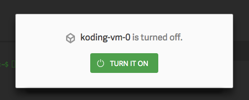
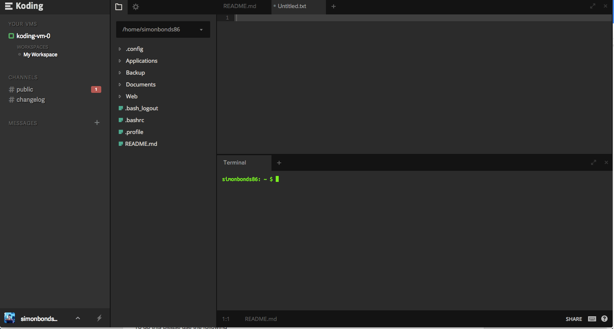
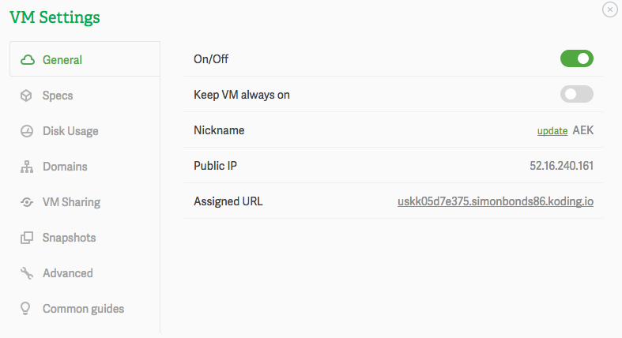

# Cloud IDE

There are a number of Cloud IDE solutions that combine a VM and IDE that you can manage entirely through your browser. This can be a useful approach should you need portability with your dev environment or if you are unable to install the appropriate software on your PC.

Most of these services offer a free plan but the the free offering is often too restricted.

We have had the best results using [www.koding.com](https://www.koding.com/) with the AEK tools.

Use the following steps to get your IDE setup and working correctly.

## Install AEK CLI with Koding

### App Manager Accounts

As with standard installations, an App Manager account is required to use most of the AEK tools. You will need sufficient permissions to create and publish AEK Screens and Menu Options.

As a number of tools are built on npm protocols that require an email address, you must ensure that your App Manager account has an email address associated with it. This can be managed in the User/Permissions section of App Manager.

### Step 1

Simply go to the koding website via this link [www.koding.com](https://www.koding.com/)

Once the website has loaded you will see a box asking for an e-mail address and password. At this point you can enter your details. You can also sign in with your Facebook, Google+ or Github account if you prefer.

It will then ask you to pick a username. You can use the default or customise this if you prefer.

Once you have clicked the “lets go” button it will take you to your IDE.

### Step 2

Upon the first load of your IDE you will see that you are asked to confirm your e-mail address is valid by entering the code that they have sent you via e-mail.

This should come through within a matter of minutes. However check your Spam folder incase it has managed to get into there.

Once you have added the code you will then see that it will say.

Simply Turn on your VM as it will start the VM for the first time.

### Step 3

NOTE: The VM itself will switch off over time so on a free account you will not be able to rely on this to be an always on system,. However if you feel like you require this you can up your pricing plan with koding and this will then be an option for you.

Once your VM has installed you will be greeted with a page like this.

On the left hand side you can see a column for your VM’s. This will allow you to edit and change the information for the VM including the nickname.

To edit any information for a VM just simply click on on the three dots that appear when you hover over the name of the VM.

Change the nickname to something useful, such as AEK, see the screenshot below.

From this screen you can also see the current Specifications of the VM you have, set up domains, and even remove or delete your VM.

Once you are happy with this close this window and you will see on the right hand side a panel which is called terminal.

Create a folder for all your AEK work to be added to. To do this click on the terminal section and the type

`mkdir AEK`

Once this is done you should see in your directory view that a new folder has been created.

NOTE : You can also do this by clicking on the arrow to the right of the path name at the top of directory view

### Step 4

You need to update NPM to allow us to run AEK successfully.

To do this simply type the following into the terminal window

`sudo npm install -g npm`

This should now have updated your version of NPM. To make sure this has worked successfully you can type the following into the terminal

`npm --version`

This should display

`2.10.1`

** At time of writing this was the latest version, If however your version is above this don't worry **

Once this has been installed you can then install the command line tools using the following command.

`sudo npm install -g https://npm.campusm.net/get/aek-cli`

Once this is done you will need to reset the permissions for npm to allow you to use this without sudo.

Use the following command to do this.

`sudo chown -R $(whoami) ~/.npm`

You are now ready to start creating your first package.

### Step 5

Navigate to the folder you previously created.

For example mine is

`cd AEK`

Once in here you can now use the aek-create command to create your package to do this use.

`aek create`

Once this has been done you should be able to now navigate to your package.

Again mine is

`cd aek-test`

From here you can now run the start command which is

`aek start`

This will then launch your webserver.

To access the web server you will need to know the address of your VM

To do this go back into the properties menu for the VM

On the first page you will see a assigned url.

Simply use this and then add the port number 5000

So for example mine is.

`http://uskkc9ad9404.simonbonds.koding.io:5000/`

You should now see the test AEK screen working correctly.

