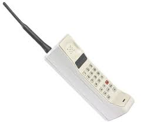

## Listview

### Listview

Listviews are a menu variation adopted from AEK 1.x. and are common components in AEK screens

  

    
Aenean eu leo quam

    
Vestibulum id ligula porta felis euismod semper.

    
Pellentesque ornare sem lacinia quam venenatis vestibulum.

  

---

### Adding links

Listviews items commonly have links.

  

    <a class="item" href="#">Aenean eu leo quam</a>
    <a class="item" href="#">Vestibulum id ligula porta felis euismod semper.</a>
    <a class="item" href="#">Pellentesque ornare sem lacinia quam venenatis vestibulum.</a>
  

You may wish to also adopt the `<ul>` HTML semantics. This is optional but will render the same visual results

  <ul class="ui listview menu">
    <li class="item"><a href="#">Aenean eu leo quam</a></li>
    <li class="item"><a href="#">Vestibulum id ligula porta felis euismod semper.</a></li>
    <li class="item"><a href="#">Pellentesque ornare sem lacinia quam venenatis vestibulum.</a></li>
  </ul>

---

### Labels

You can also add labels.

  

    

      <h5 class="label">Label 1</h5>
      
Dapibus Purus Ipsum

    

    

      <h5 class="label">Label 2</h5>
      
Pellentesque ornare sem lacinia quam venenatis vestibulum. Pellentesque ornare sem lacinia quam venenatis vestibulum. Pellentesque ornare sem lacinia quam venenatis vestibulum.

    

  

  

    

      <h5 class="brandcolour label">Label 1</h5>
      
Dapibus Purus Ipsum

    

    

      <h5 class="prime label">Label 2</h5>
      
Pellentesque ornare sem lacinia quam venenatis vestibulum. Pellentesque ornare sem lacinia quam venenatis vestibulum. Pellentesque ornare sem lacinia quam venenatis vestibulum.

    

  

---

### Basic Labels

  

    

      <h5 class="label">Label 1</h5>
      
Dapibus Purus Ipsum

    

    

      <h5 class="alt label">Label 2</h5>
      
Pellentesque ornare sem lacinia quam venenatis vestibulum. Pellentesque ornare sem lacinia quam venenatis vestibulum. Pellentesque ornare sem lacinia quam venenatis vestibulum.

    

  

  

    

      <h5 class="basic label">Label 1</h5>
      
Dapibus Purus Ipsum

    

    

      <h5 class="brandcolour basic label">Label 2</h5>
      
Pellentesque ornare sem lacinia quam venenatis vestibulum. Pellentesque ornare sem lacinia quam venenatis vestibulum. Pellentesque ornare sem lacinia quam venenatis vestibulum.

    

  

---

### Flow

Labels are restricted to a maximum of a third the item width

  

    

      <h5 class="label">Pellentesque ornare sem lacinia quam venenatis vestibulum.</h5>
      

        
Fusce dapibus, tellus ac cursus commodo, tortor mauris condimentum nibh, ut fermentum massa justo sit amet risus.

        
Aenean lacinia bibendum nulla sed consectetur. Maecenas sed diam eget risus varius blandit sit amet non magna.

      

    

    

      <h5 class="label">Vivamus sagittis lacus vel augue laoreet rutrum faucibus dolor auctor.</h5>
      
Nullam quis risus eget urna mollis ornare vel eu leo. Cras mattis consectetur purus sit amet fermentum. Maecenas faucibus mollis interdum. Etiam porta sem malesuada magna mollis euismod.

    

  

You may wish to couple labels with the `ellipsis` class to prevent line wrapping

  

    

      <h5 class="basic ellipsis label">Pellentesque ornare sem lacinia quam venenatis vestibulum.</h5>
      

        
Fusce dapibus, tellus ac cursus commodo, tortor mauris condimentum nibh, ut fermentum massa justo sit amet risus.

        
Aenean lacinia bibendum nulla sed consectetur. Maecenas sed diam eget risus varius blandit sit amet non magna.

      

    

    

      <h5 class="ellipsis label">Vivamus sagittis lacus vel augue laoreet rutrum faucibus dolor auctor.</h5>
      
Nullam quis risus eget urna mollis ornare vel eu leo. Cras mattis consectetur purus sit amet fermentum. Maecenas faucibus mollis interdum. Etiam porta sem malesuada magna mollis euismod.

    

  

By default labels will adjust to the size of the text.

  

    <a class="item">
      Name
      First Name
    </a>
    <a class="item">
      Last Name
      Surname
    </a>
    <a class="item">
      Address
      121 Fake Street, Jones Close, Wolverhampton, United Kingdom
    </a>
  

You may wish to enforce uniform width

  

    <a class="item">
      Name
      First Name
    </a>
    <a class="item">
      Last Name
      Surname
    </a>
    <a class="item">
      Address
      121 Fake Street, Jones Close, Wolverhampton, United Kingdom
    </a>
  

The default uniform width is `25%`, you can adjust this with some simple custom css

  

  

    <a class="item">
      Name
      First Name
    </a>
    <a class="item">
      Last Name
      Surname
    </a>
    <a class="item">
      Address
      121 Fake Street, Jones Close, Wolverhampton, United Kingdom
    </a>
  

---

### Stackable Labels (responsive)

Labels will automatically stack on mobile devices if you use the `stackable` variation (resize the window to see the result)

  

    <a class="item">
      
Label 1

      
Test Information

    </a>
    <a class="item">
      
Label 2

      
Test Information Test Information

    </a>
  

  

    <a class="item">
      
Label 1

      
Test Information

    </a>
    <a class="item">
      
Label 2

      
Test Information Test Information

    </a>
  

---

### Stacked Labels

`stacked` labels are always stacked regardless of the viewport size

  

    <a class="item">
      
Label 1

      
Test Information

    </a>
    <a class="item">
      
Label 2

      
Test Information Test Information

    </a>
  

  

    <a class="item">
      
Label 1

      
Test Information

    </a>
    <a class="item">
      
Label 2

      
Test Information Test Information

    </a>
  

---

### Right Labels

labels can also be added to the right of the menu item

  

    

      <a href="#">
        

          
Item One

          

22

        

      </a>
    

    

      

        

          <h3>Item Two</h3>
          
Another line

        

        

          
23

        

      

    

  

---

### Thumbnails

Listviews can include thumbnails

  

    <a class="item">
      

        

        
Standard thumbnail

      

    </a>
    <a class="item">
      

        

        
Example with some multiple lines

      

    </a>
    <a class="item">
      

        

        
Bordered thumbnail

      

    </a>
    <a class="item">
      

        

        
Rounded thumbnail

      

    </a>
    <a class="item">
      

        

        
Rounded and bordered

      

    </a>
  

Text will be centered where required with thumbnails always positioned at the top

  

    <a class="item">
      

        

        

          
Duis mollis, est non commodo luctus, nisi erat porttitor ligula, eget lacinia odio sem nec elit.

          
Maecenas sed diam eget risus varius blandit sit amet non magna.

          
Fusce dapibus, tellus ac cursus commodo, tortor mauris condimentum nibh, ut fermentum massa justo sit amet risus.

        

      

    </a>
  

---

### Sizes

The source images for thumbnails can have arbitrary dimensions

  

    <a class="item">
      

        

        
Wide image

      

    </a>
    <a class="item">
      

        

        
Tall image

      

    </a>
  

It is often sensible to restrict the dimensions of a thumbnail to a uniform sized square.

  

    <a class="item">
      

        
<aek-img style="background-image:url(../images/tn2001301.jpeg)"/>

        
Mini

      

    </a>
    <a class="item">
      

        
<aek-img style="background-image:url(../images/tn2001301.jpeg)"/>

        
Tiny

      

    </a>
    <a class="item">
      

        
<aek-img style="background-image:url(../images/tn2001301.jpeg)"/>

        
Small

      

    </a>
    <a class="item">
      

        
<aek-img style="background-image:url(../images/tn2001301.jpeg)"/>

        
Medium

      

    </a>
    <a class="item">
      

        
<aek-img style="background-image:url(../images/tn2001301.jpeg)"/>

        
Large

      

    </a>
    <a class="item">
      

        
<aek-img style="background-image:url(../images/tn2001301.jpeg)"/>

        
Big

      

    </a>
    <a class="item">
      

        
<aek-img style="background-image:url(../images/tn2001301.jpeg)"/>

        
Huge

      

    </a>
  

*note the use of `<aek-img style="background-image:"/>` instead of ``*

---

### Icons Thumbnails

Instead of images, you can also use icons.

  

    <a class="item">
      

        <i class="student icon"></i>
        
Mini

      

    </a>
    <a class="item">
      

        <i class="student icon"></i>
        
Tiny

      

    </a>
    <a class="item">
      

        <i class="student icon"></i>
        
Small

      

    </a>
    <a class="item">
      

        <i class="student icon"></i>
        
Medium

      

    </a>
    <a class="item">
      

        <i class="student icon"></i>
        
Large

      

    </a>
    <a class="item">
      

        <i class="student icon"></i>
        
Big

      

    </a>
    <a class="item">
      

        <i class="student icon"></i>
        
Huge

      

    </a>
  

---

### Containment / Cropping

Sized thumbnails always remain square, even if the source image is not. By default, this is achieved by cropping the image so that it can cover cover the available space.

Alternatively, if you want to ensure that all of the source image is visible, you can use the `contained` variation.

  

    <a class="item">
      

        
<aek-img style="background-image:url(../images/tn2001001.jpeg)"/>

        
Normal (cropped)

      

    </a>
    <a class="item">
      

        
<aek-img style="background-image:url(../images/tn2001001.jpeg)"/>

        
Contained

      

    </a>
    <a class="item">
      

        
<aek-img style="background-image:url(../images/tn1002001.jpeg)"/>

        
Normal (cropped)

      

    </a>
    <a class="item">
      

        
<aek-img style="background-image:url(../images/tn1002001.jpeg)"/>

        
Contained

      

    </a>
  

---

### Item Formatting

Listviews support inner formatting within each element. Use the `formatted` class to present headings and paragraphs without margin in a similar style to AEK 1.x

  

    <a class="item">
      <h2>Heading Two</h2>
      
Paragraph

    </a>
    <a class="item">
      <h3>Heading Three</h3>
      
Paragraph

    </a>
    <a class="item">
      <h4>Heading Four</h4>
      
Paragraph

    </a>
    <a class="item">
      <h5>Heading Five</h5>
      
Paragraph

    </a>
  

  

    <a class="item">
      
<em>Small Text</em>

      
Large Text

      
Paragraph

    </a>
    <a class="item">
      
<em>Small Text</em>

      
Large Text

      
Paragraph

    </a>
  

  

    <a class="item">
      

        
<aek-img style="background-image:url(../images/tn20020001.jpeg)"/>

        

          <h2>Heading Two</h2>
          
Large Text

          
<em>Normal Text</em>

        

      

    </a>
    <a class="item">
      

        
<aek-img style="background-image:url(../images/old-phone.jpg)"/>

        

          
<em>Small</em>

          
Large Text

          <h4>Heading Four</h4>
          
Normal Text

        

      

    </a>
    <a class="item">
      

        <i class="rocket icon"></i>
        

          <h3>Heading Three</h3>
          
Normal Text

          
<em>Small</em>

        

      

    </a>
    <a class="item">
      

        

        

          
Small

          <h5>Heading Five</h5>
          
Normal Text

        

      

    </a>
    <a class="item">
      

        
left

        <i class="at icon"></i>
        

          
Small

          <h5>Heading Five</h5>
          
Normal Text

        

        
right

      

    </a>
  

---

### Listview Flush

A menu can also be flush with the parent element

  

    

      <a class="item">
        Item One
      </a>
      <a class="item">
        Item Two
      </a>
      <a class="item">
        Item Three
      </a>
    

  

---

## Variations

Listviews inherit many of the variations from menu

### Active

A menu item can be active or disabled

  

    

      Active Item
    

    

      Normal Item
    

    

      Disabled Item
    

  

---

### Inverted Listview

A menu may have its colors inverted to show greater contrast

  

    <a class="active item">
      Active Item
    </a>
    <a class="item">
      Normal Item
    </a>
    <a class="disabled item">
      Disabeld Item
    </a>
  

---

### Theme Colors

Additional theme colors can be specified.

  

    <a class="active item">
      Active Item
    </a>
    <a class="item">
      Normal Item
    </a>
    <a class="disabled item">
      Disabeld Item
    </a>
  

  

    <a class="active item">
      Active Item
    </a>
    <a class="item">
      Normal Item
    </a>
    <a class="disabled item">
      Disabeld Item
    </a>
  

These theme colors can also be inverted

  

    <a class="active item">
      Active Item
    </a>
    <a class="item">
      Normal Item
    </a>
    <a class="disabled item">
      Disabeld Item
    </a>
  

  

    <a class="active item">
      Active Item
    </a>
    <a class="item">
      Normal Item
    </a>
    <a class="disabled item">
      Disabeld Item
    </a>
  

  

    <a class="item">
      

        
<aek-img style="background-image:url(../images/tn20020001.jpeg)"/>

        

          <h2>Heading Two</h2>
          
Normal Text

        

      

    </a>
    <a class="item">
      

        <i class="rocket icon"></i>
        

          
<em>Small</em>

          <h3>Heading Three</h3>
          
Normal Text

        

      

    </a>
    <a class="item">
      

        
<aek-img style="background-image:url(../images/tn20020002.jpeg)"/>

        

          
<em>Small</em>

          
Large Text

          
Normal Text

        

      

    </a>
    <a class="item">
      

        

        

          
Small

          <h5>Heading Five</h5>
          
Normal Text

        

      

    </a>
  

---

### Borderless

A menu item or menu can have no borders

  

    <a class="item">Item One</a>
    <a class="item">Item Two</a>
    <a class="item">Item Three</a>
  

---
