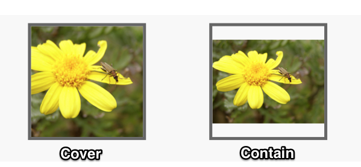

# ImagePicker

## constructor

```javascript
new ImagePicker(options:Object)
```

## options

name | description
-------|--------------
`width` | (optional) minimum width in pixels (defaults to 500)
`height` | (optional) minimun height in pixels (default to 500)
`format` | (optional) output format [`"jpg"` or `"png"`] <br/> (defaults to `"jpg"`)
`quality` | (optional) compression quality percentage for "jpg" format. <br/> This should parse an integer from the given string so `"50%"` or `"50.32"` or `"50"` would all be treated the same <br/> (defaults to `"80"`)
`camera` | (optional) specify which camera to use initially [`"front"` or `"back"`] <br/> (defaults to `"back"`)
`save` | (optional) save image to photo album [`"yes"` or `"no"`] <br/> (defaults to `"no"`)
`sizing` | (optional) sizing mode [`"cover"` or `"contain"` or `"usercrop"`] <br/> (defaults to `"contain"`) <br/> _see below for explanation_
`overlay` | (optional) specify an overlay image (url) to be overlayed over user cropping interface for user guidance


## sizing options

name | description
-------|--------------
`"cover"` | Scale the image to be as large as possible so that the target area is completely covered. The image should be centered in the target area and some parts of the image may need to be cropped evenly on each side.
`"contain"` | Scale the image to the largest size such that both its width and its height can fit inside the target area. Any excess pixels should be removed so that the resulting image might be smaller than the target dimension on one of the axis
`"usercrop"` | native interface providing user the ability to move and scale the image within the target area. The initial view of this should default to a centered crop as per `"cover"` option



## events

### `complete`

called when user has selected and (where appropriate) cropped an image

#### event arguments
* `data` : (object) all returned data provided in a js object as a single argument


##### `data` properties
* `imageData` : (string) base64 encoded data
* `format` : (string) image format (`"jpg"` or `"png"`)
* `width` : (integer) pixel width of final image
* `height` : (integer) pixel height of final image
* `meta` : (object) additional supporting data (_see below_)

##### `data.meta` properties
The following are not required but should be provided if available
* `lat` : (float) Latitude for location where photo was captured
* `lon` : (float) Longitude for location where photo was captured
* `captured` : (string) Date/Time that image was captured - `YYYY-MM-DDTHH:mm:ss-TH:TM` (ISO 8601)
* `filename` : (string) filename of image


### `cancel`

called when user cancels the process (no arguments)

### `error`

called when something goes wrong

event arguments

* `message` : (string) friendly message describing the error
* `details` : (object) optional details about the error

## Example AEK implementation

``` javascript

import {ImagePicker} from "@ombiel/aek-lib";

const imagePicker = new ImagePicker({
  width:200,
  height:300,
  format:"jpg",
  quality:50,
  camera:"front",
  save:"yes",
  sizing:"cover",
  overlay:"http://myimage.com/silhouette.png"
});

imagePicker.on("complete",(data)=>{
  const img = new Image();
  img.src = `data:image/${data.format};base64,${data.imageData}`;
});

imagePicker.on("error",(message,details)=> {
  alert(message);
});

imagePicker.on("cancel",()=> {
  alert("You must choose an image");
}


```
